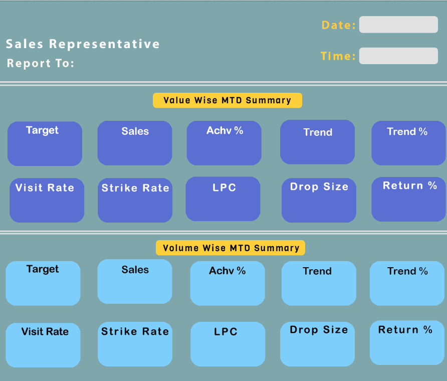

# TCPL PSR Sales Performance Analysis

## Project Overview

This project is an automated sales performance reporting system built using SQL Server, Python, and dashboard visualization concepts. It analyzes PSR/SR sales performance, monthly targets, sales achievement, customer activity, returns, drop size, LPC, visit rate, and strike rate.

The project demonstrates an end-to-end analytics workflow: data extraction, SQL-based KPI calculations, Python automation, dashboard image generation, Excel report creation, and automated email delivery.

---

## Business Problem

Sales teams need daily visibility into representative performance, target achievement, sales trends, and customer coverage. Manual reporting is time-consuming and can create delays in decision-making.

This project automates the reporting process and provides a structured performance view for sales representatives and managers.

---

## Objectives

- Analyze PSR/SR sales performance
- Compare sales against monthly targets
- Calculate value-wise and volume-wise KPIs
- Track customer visit and strike rates
- Measure LPC and drop size
- Generate SKU-level target vs sales reports
- Automate dashboard and email reporting

---

## Tech Stack

- Python
- SQL Server
- T-SQL
- Pandas
- PyODBC
- Pillow
- Matplotlib
- Excel
- Email Automation
- Photoshop dashboard design

---

## Project Workflow

1. Extract sales, target, return, customer, and SKU data from SQL Server
2. Clean and aggregate data using SQL and Python
3. Calculate KPIs such as achievement %, visit rate, strike rate, LPC, and drop size
4. Generate dashboard visuals and KPI images
5. Export SKU-level report to Excel
6. Send automated email report with images and attachments

---

## KPI Metrics

| KPI | Description |
|---|---|
| Target | Monthly sales or volume goal |
| Sales | Actual MTD sales performance |
| Achievement % | Sales compared to target |
| Trend | Projected month-end performance |
| Trend % | Projected performance compared to target |
| Visit Rate | Customer visits compared to customer base |
| Strike Rate | Effective buying customers compared to total customers |
| LPC | Lines per call / average number of products per invoice |
| Drop Size | Average sales value or volume per invoice |
| Return % | Returned value or volume compared to sales |

---

## Dashboard Preview



---

## Folder Structure

```text
TCPL-PSR-Sales-Performance-Analysis/
│
├── README.md
├── requirements.txt
├── .gitignore
├── .env.example
│
├── src/
│   ├── main.py
│   ├── path.py
│   ├── srid.py
│   └── database.py
│
├── sql/
│   ├── queries.sql
│   └── queries_notes.txt
│
├── notebooks/
│   └── test.ipynb
│
├── assets/
│   └── TCPL_DASH_report.psd
│
├── images/
│   └── dashboard_preview.png
